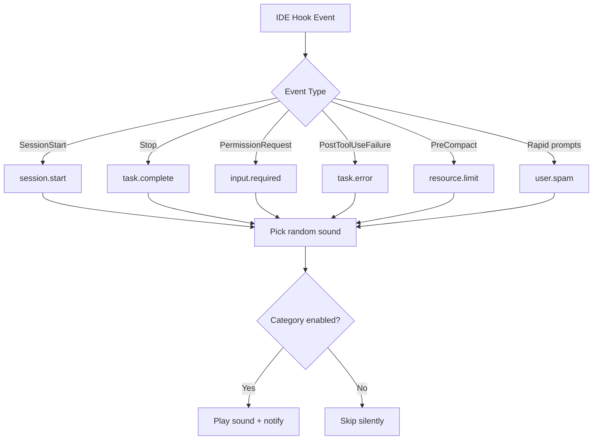

PeonPing implements the [Coding Event Sound Pack Specification (CESP)](https://github.com/PeonPing/openpeon) — an open standard for coding event sounds that any agentic IDE can adopt.

## Event Categories

Every sound in PeonPing is organized into CESP categories. Each category triggers in response to specific IDE events:

<Tabs>
  <Tab title="session.start">
    **When it plays:** When a new coding session begins
    
    **Hook events:**
    - `SessionStart`
    - First interaction with the agent
    
    **Example sounds:**
    - *"Ready to work?"* (Peon)
    - *"Yes, milord?"* (Peasant)
    - *"Battlecruiser operational"* (StarCraft Battlecruiser)
    - *"Oh, it's you."* (GLaDOS)
    
    **Configuration:**
    ```bash
    peon preview session.start  # Test all greeting sounds
    ```
  </Tab>
  
  <Tab title="task.complete">
    **When it plays:** When the agent finishes a task and waits for your input
    
    **Hook events:**
    - `Stop`
    - `AfterAgent` (Gemini CLI)
    - `post_cascade_response` (Windsurf)
    
    **Example sounds:**
    - *"Work, work."* (Peon)
    - *"Job's done!"* (Peasant)
    - *"I gotcha"* (Kerrigan)
    - *"Make it happen"* (Battlecruiser)
    
    **Smart filtering:**
    ```json
    {
      "silent_window_seconds": 10,
      "suppress_subagent_complete": true
    }
    ```
    
    Suppress sounds for tasks shorter than 10 seconds or when sub-agents complete.
  </Tab>
  
  <Tab title="input.required">
    **When it plays:** When the agent needs your permission or input
    
    **Hook events:**
    - `PermissionRequest`
    - `Notification` (with permission context)
    
    **Example sounds:**
    - *"Something need doing?"* (Peon)
    - *"Hmm?"* (Kerrigan)
    - *"What you want?"* (Peon)
    
    **Use case:** Tool approval requests, file write confirmations
  </Tab>
  
  <Tab title="task.error">
    **When it plays:** When a tool or command fails
    
    **Hook events:**
    - `PostToolUseFailure`
    - `errorOccurred` (GitHub Copilot)
    - `AfterTool` with failure status
    
    **Example sounds:**
    - *"I can't do that."* (Peon)
    - *"Son of a bitch!"* (Duke Nukem)
    - *"Your entire team is dead."* (GLaDOS)
  </Tab>
  
  <Tab title="resource.limit">
    **When it plays:** When the agent hits rate limits or token limits
    
    **Hook events:**
    - `PreCompact` (context compaction)
    - API rate limit errors
    
    **Example sounds:**
    - *"Zug zug."* (Peon)
    
    **Note:** Pack-dependent — not all packs include resource limit sounds
  </Tab>
  
  <Tab title="user.spam">
    **When it plays:** When you send 3+ prompts in 10 seconds
    
    **Configuration:**
    ```json
    {
      "annoyed_threshold": 3,
      "annoyed_window_seconds": 10
    }
    ```
    
    **Example sounds:**
    - *"Me busy, leave me alone!"* (Peon)
    - *"Easily amused, huh?"* (Kerrigan)
    
    **Purpose:** Easter egg to discourage rapid-fire prompting
  </Tab>
  
  <Tab title="task.acknowledge">
    **When it plays:** When the agent acknowledges receiving your task
    
    **Hook events:**
    - `PreToolUse`
    - Early task acceptance
    
    **Example sounds:**
    - *"I read you."* (Kerrigan)
    - *"On it."* (Generic)
    
    **Default:** Disabled (too noisy)
    
    ```json
    {
      "categories": {
        "task.acknowledge": false
      }
    }
    ```
  </Tab>
</Tabs>

## Extended Categories

These categories are defined in the CESP spec but not currently triggered by built-in hooks:

| Category | Purpose | Status |
|----------|---------|--------|
| `session.end` | Session termination | Spec only |
| `task.progress` | Progress updates during long tasks | Spec only |

## Managing Event Categories

### Enable/Disable Categories

Toggle specific event categories without affecting others:

```bash
# Using the CLI
peon preview --list  # Show all categories in active pack

# Test a specific category
peon preview task.error

# Or ask Claude to modify your config
# "Disable session start sounds"
# "Enable task acknowledge sounds"
```

### Configuration File

Edit `~/.claude/hooks/peon-ping/config.json` directly:

```json
{
  "categories": {
    "session.start": true,
    "task.acknowledge": false,
    "task.complete": true,
    "task.error": true,
    "input.required": true,
    "resource.limit": true,
    "user.spam": true
  }
}
```

<Accordion title="Advanced: Per-pack category availability">
  Not all sound packs include all categories. The `openpeon.json` manifest in each pack defines which categories are supported.
  
  When a category triggers but the active pack doesn't have sounds for it, PeonPing silently skips playback.
  
  **Example:** The `glados` pack has extensive `task.error` sounds, while some minimal packs may only support `session.start` and `task.complete`.
</Accordion>

## Event Flow Diagram



## Related Configuration

<CardGroup cols={2}>
  <Card title="Sound Packs" icon="music" href="/features/sound-packs">
    Browse 165+ packs and switch between characters
  </Card>
  <Card title="Notifications" icon="bell" href="/features/notifications">
    Desktop overlay and mobile push notifications
  </Card>
</CardGroup>
